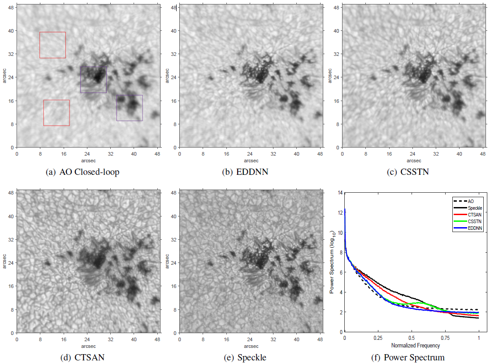

# CTSAN

### Cascaded Temporal and Spatial Attention Network for Solar AO Image Restoration


* By Chi Zhang*, Shuai Wang*, Libo Zhong, Qingqing Chen, Changhui Rao† ( * authors contributed equally, † corresponding author ).


* This work is based on [CDVD-TSP](https://github.com/csbhr/CDVD-TSP) and [EDVR](https://xinntao.github.io/projects/EDVR). We truly and sincerely thank their open source contributions !


### Overview

* An overview of proposed CTSAN architecture. Panel (a) shows the network detail of the TSAN unit. Panel (b) is the input and output of a
single TSAN unit. Panel (c) shows the forward process of CTSAN. 
* Only one set of TSAN parameter is trained during backward propagation and then used four times in forward propagation to construct the cascaded two-stage architecture. 


### Result
* CTSAN has a stable performance in restoring lowest granulation contrast frames of TiO band captured by [NVST telescope](http://fso.ynao.ac.cn/index.aspx) with GLAO correction system, indicating our cascaded network may has the potential to maintain a stable performance in actual astronomical observation conditions.




### Environments and Dependencies

* We run CTSAN model on Linux sytem with configuration of Ubuntu 20.04, CUDA 11.7, and GPU RTX 3090.  
```
Python 3 (Anaconda is preferred)  

Pytorch:   
	conda install pytorch torchvision torchaudio pytorch-cuda=11.7 -c pytorch -c nvidia
	
numpy: 
	conda install numpy
	
matplotlib: 
	conda install matplotlib
	
opencv: 
	conda install oepncv
	
imageio:
	conda install imageio
	
skimage: 
	conda install scikit-image
	
tqdm: 
	conda install tqdm
	
cupy: 
	pip install cupy-cuda117 or conda install -c anaconda cupy
	
```
### Download from Google Drive

1. Please download the PWC-Net Pretrained parameter frome [here](https://drive.google.com/drive/folders/11Sr3S2sEzwB4XUq4-SYfTcDN06P3qu9M?usp=share_link) if your want to train/test CTSAN.  

   After download the file named network-default.pytorch, please put it into this folder: "./pretrain_models".  
		


2. Please download it from [here](https://drive.google.com/drive/folders/11Sr3S2sEzwB4XUq4-SYfTcDN06P3qu9M?usp=share_link)  if you want to use the CTSAN parameters trained on our NVST real AO dataset.  

   After download, please put them into this folder: "./Trained_Model".
   
   
### Open Source Dataset

* We have released a portion of testing sets in CSSTN website, please download from [here](https://github.com/ShuaiWangUESTC/CSSTN/tree/main/datasets/data/DeepVideoDeblurringDataset/test/data_656).


### Dataset Organization

* Please organize your prepared training/validation/testing sets ( .img or .jpg image format ) following this catalog structure:
```
|--dataset
   |--blur
      |--burst 1
	  |--frame 1
	  |--frame 2
	  |--   .
	  |--   .
	  |--frame n
      |--burst 2
      |--    .
      |--    .
      |--burst n
   |--gt
      |--burst 1
          |--frame 1
          |--frame 2
          |--   .
          |--   .
          |--frame n
      |--burst 2
      |--   .
      |--   .
      |--burst n
		

```


### Training

```
cd ./code

python main.py --save  path_to_save_your_result  --dir_data your_training_data_path   --dir_data_test your_validation_data_path  --epochs total_epoch_number  --batch_size 8
``` 

* After setting these five parameters, the result will be saved in "./experiment".  

* If you want to get some intermediate results, please set the optional item save_images in the path of "./code/option/init.py" as True, which will greatly prolong the training time.


### Inference

#### 1. test on your own trained parameter：
```
cd ./code

python inference.py  --data_path  your_test_data_path  --model_path saved_model_parameter_path  
```

* After setting these two paths, the result will be saved in "./infer_results".

* If you want to save the restored results as image formats, please set the optional item save_images in the path of "./code/inference.py" as True, which will greatly prolong the inference time.


#### 2. test using our trained parameter:


* Please place your test data and our trained parameter according to the dir at the last few lines of file inference.py, and then:
```
cd ./code

python inference.py  --default_data model_abbreviation
```

* Three trained models are provided in our google drive, 

	CTSAN_TiO_Convergent.pt for restoring 705nm data (--default_data  TiO), 

	CTSAN_Dual_Convergent.pt for restoring 656nm or 705nm data (--default_data  Dual). 

	CTSAN_656nm2_EarlyStop.pt, an Early Stop model to restore the second 656nm data (--default_data  EarlyStop).

### Citation

@article{zhang2023cascaded,  
  title={Cascaded Temporal and Spatial Attention Network for Solar Adaptive Optics Image Restoration},  
  author={Chi Zhang*, Shuai Wang*, Libo Zhong, Qingqing Chen, Changhui Rao},  
  journal={Astronomy \& Astrophysics},  
  volume={ },  
  pages={ },  
  year={2023},  
  publisher={EDP Sciences}  
}


### Contact Us

* Please send email to zhangchi[dot]ch[AT]gmail.com or wangshuai0601[AT]uestc[dot]edu[dot]cn.
